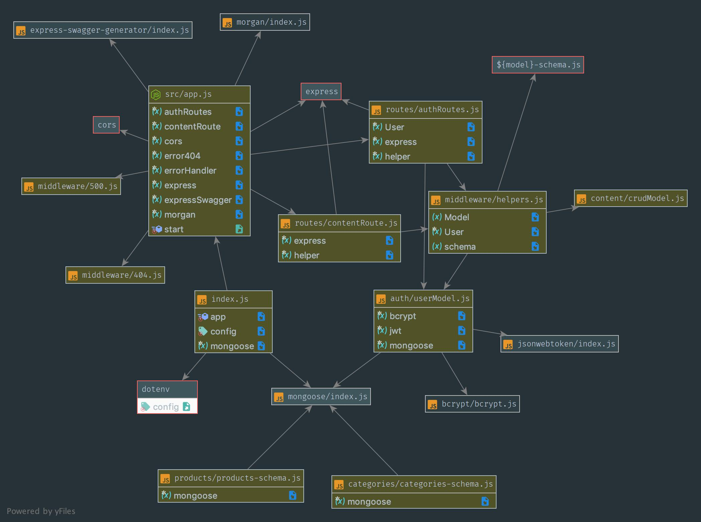

# LAB - 15

## Build API Server

### Author: Eric Huang

### Links and Resources
* [submission PR](https://github.com/erichuang-401-advanced-javascript/401-lab-15/pull/3)
* [travis](https://www.travis-ci.com/erichuang-401-advanced-javascript/401-lab-15)
* [front-end](https://erichuang-401-lab15.herokuapp.com/)

#### Documentation
* [jsdoc](https://erichuang-401-lab15.herokuapp.com/docs)
* [swagger](https://erichuang-401-lab15.herokuapp.com/api-docs)

### Modules
#### 404
#### 500
#### helpers
#### userModel
#### authRoutes
#### contentRoutes

### Setup
#### `.env` requirements
* `PORT` - Port Number
* `MONGODB_URI` - URL to the running mongo instance/db
* `SECRET` - Secret for authentication

#### Running the app
* `npm run start/watch`
* `npm run startDB`
* Endpoint: `/signup`
* Endpoint: `/signin`
  * Returns a token
* Endpoint: `/content/products`
  * GET/PUT/POST/DELETE - for GET, PUT, DELETE enter product ID as query
* Endpoint: `/content/categories`
  * GET/PUT/POST/DELETE - for GET, PUT, DELETE enter product ID as query

#### Tests
* Lint test: `npm run lint`

#### UML

